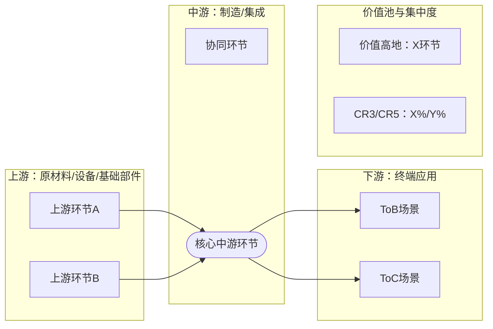

# 📈 [Target_Name] 机构级产业链图谱与上下游深度分析报告
*(报告等级：机构深度投研级 | 数据基准日：[YYYY-MM-DD] | 分析模式：[常规深度分析 / 第一性原理推演])*

> 使用说明（严格约束）
> 1. 必须按本模板从 0 到 9 完整输出，禁止跳章。
> 2. 每章至少包含“结论 + 证据 + 日期口径”。
> 3. 每个核心链路章节必须有表格，且每表至少 3 家企业（垄断行业例外需说明）。

## 0. 任务卡与研究边界 (Task Card)
- **研究对象**：[公司/行业]
- **业务边界定义**：[本报告覆盖的子行业/产品边界]
- **地理边界**：[中国/全球/区域]
- **时间边界**：[近3年/近5年]
- **统计口径**：[营收口径/出货量口径/装机口径]
- **任务类型**：[首次覆盖 / 跟踪更新 / 事件驱动]

## 1. 数据检索清单与证据台账 (Evidence Log)

### 1.1 数据检索路径（必须填写）
1. 一手披露：财报、招股书、交易所公告。
2. 二手权威：行业协会、监管机构、头部数据库、权威媒体。
3. 交叉验证：关键指标至少双来源比对。

### 1.2 证据台账表（至少8行）
| 指标名称 | 数值/区间 | 日期口径 | 来源类型 | 来源名称 | 可信度评级(A/B/C) | 用于哪一章 |
| :--- | :--- | :--- | :--- | :--- | :--- | :--- |
| [示例：中游CR3] | [45%-55%] | [2025Q3] | [财报/协会/数据库] | [来源名称] | [A] | [3.2] |
| [指标2] | ... | ... | ... | ... | ... | ... |
| [指标3] | ... | ... | ... | ... | ... | ... |
| [指标4] | ... | ... | ... | ... | ... | ... |
| [指标5] | ... | ... | ... | ... | ... | ... |
| [指标6] | ... | ... | ... | ... | ... | ... |
| [指标7] | ... | ... | ... | ... | ... | ... |
| [指标8] | ... | ... | ... | ... | ... | ... |

## 2. 执行摘要 (Executive Summary)
*(建议300-600字，至少5条要点)*

1. **行业定性**：[周期/成长/科技迭代型]
2. **核心投资逻辑**：[一句话结论 + 两条证据]
3. **利润池位置**：[微笑曲线高地在哪]
4. **最大边际变化**：[未来12-24个月最关键变量]
5. **关键风险提示**：[至少3条]

## 3. 产业链全景图谱与价值池

### 3.1 产业链主图 (Mermaid)

### 3.2 微笑曲线与利润分配表（必填）
| 环节 | 利润率区间 | 议价权强弱 | 价值捕获原因 | 数据日期 |
| :--- | :--- | :--- | :--- | :--- |
| 上游 | [X%-Y%] | [强/中/弱] | [原因] | [YYYYQX] |
| 中游 | [X%-Y%] | [强/中/弱] | [原因] | [YYYYQX] |
| 下游 | [X%-Y%] | [强/中/弱] | [原因] | [YYYYQX] |

### 3.3 BOM成本拆解表（必填）
| 成本项目 | 占中游成本比例 | 近3年变化方向 | 影响因素 | 数据日期 |
| :--- | :--- | :--- | :--- | :--- |
| [核心材料1] | [X%-Y%] | [上升/下降/平稳] | [原因] | [YYYYQX] |
| [核心材料2] | [X%-Y%] | ... | ... | ... |
| [核心材料3] | [X%-Y%] | ... | ... | ... |

## 4. 上游深度拆解 (Upstream Deep Dive)
*(建议600字以上)*

### 4.1 行业结构与供需
- 当前产能、开工率、供需缺口、库存周期结论。

### 4.2 技术与壁垒
- 技术路线、核心门槛（资金/认证/工艺/资源）。

### 4.3 代表企业对比表（至少3家）
| 企业 | 核心产品 | 市占率 | 毛利率区间 | 产能/产量 | 核心壁垒 | 数据日期 |
| :--- | :--- | :--- | :--- | :--- | :--- | :--- |
| [公司A] | ... | ... | ... | ... | ... | ... |
| [公司B] | ... | ... | ... | ... | ... | ... |
| [公司C] | ... | ... | ... | ... | ... | ... |

## 5. 中游深度拆解 (Midstream Deep Dive)
*(建议800字以上)*

### 5.1 竞争格局与集中度
- CR3/CR5、价格战状态、良率与规模效应。

### 5.2 市场空间与盈利模式
- TAM/SAM/SOM 或等价测算框架；收入驱动拆分。

### 5.3 代表企业对比表（至少3家）
| 企业 | 核心产品 | 市占率 | 毛利率区间 | 单位经济性 | 订单能见度 | 数据日期 |
| :--- | :--- | :--- | :--- | :--- | :--- | :--- |
| [公司D] | ... | ... | ... | ... | ... | ... |
| [公司E] | ... | ... | ... | ... | ... | ... |
| [公司F] | ... | ... | ... | ... | ... | ... |

## 6. 下游深度拆解 (Downstream Deep Dive)
*(建议600字以上)*

### 6.1 需求驱动与渗透率
- 政策驱动/市场驱动拆分；渗透率所处阶段判断。

### 6.2 客户结构与议价关系
- 头部客户集中度、绑定模式、账期与现金流影响。

### 6.3 终端客户/品牌表（至少3家）
| 客户/品牌 | 应用场景 | 采购策略 | 对上游议价能力 | 增长弹性 | 数据日期 |
| :--- | :--- | :--- | :--- | :--- | :--- |
| [品牌G] | ... | ... | ... | ... | ... |
| [品牌H] | ... | ... | ... | ... | ... |
| [品牌I] | ... | ... | ... | ... | ... |

## 7. 情景分析与估值锚 (Scenario Analysis)

| 情景 | 关键假设 | 触发条件 | 产业链利润再分配 | 对应策略 |
| :--- | :--- | :--- | :--- | :--- |
| Bear | [假设] | [条件] | [影响] | [策略] |
| Base | [假设] | [条件] | [影响] | [策略] |
| Bull | [假设] | [条件] | [影响] | [策略] |

## 8. 风险、催化剂与跟踪指标

### 8.1 风险清单（至少5条）
1. [风险1]
2. [风险2]
3. [风险3]
4. [风险4]
5. [风险5]

### 8.2 催化剂清单（至少3条）
1. [催化剂1]
2. [催化剂2]
3. [催化剂3]

### 8.3 月度跟踪指标面板
| 指标 | 当前值 | 目标区间 | 预警阈值 | 更新频率 |
| :--- | :--- | :--- | :--- | :--- |
| [指标1] | ... | ... | ... | 月度 |
| [指标2] | ... | ... | ... | 月度 |
| [指标3] | ... | ... | ... | 月度 |

## 9. 数据来源与质量闸门 (Sources & Quality Gate)

### 9.1 数据来源
- [来源1：公司财报/公告]
- [来源2：行业协会/监管]
- [来源3：数据库/权威媒体]

### 9.2 输出前质量闸门（逐项打勾）
- [ ] 章节 0-9 是否完整。
- [ ] 上中下游表格是否均>=3家企业。
- [ ] 关键数字是否均标注日期或估计假设。
- [ ] CR3/CR5、毛利率、BOM占比是否齐全。
- [ ] 财务逻辑校验是否通过（调用`scripts/validate_financials.py`）。

### 9.3 自动评分结果摘要（调用`scripts/quality_scorer.py`）
| 评分维度 | 分值权重 | 得分 | 说明 |
| :--- | :--- | :--- | :--- |
| 结构完整性 | 25 | [X/25] | [缺失章节/层级问题说明] |
| 定量严谨性 | 25 | [X/25] | [CR、毛利、BOM、日期口径覆盖度] |
| 证据质量 | 25 | [X/25] | [来源类别是否齐全、是否交叉验证] |
| 逻辑一致性 | 25 | [X/25] | [财务逻辑、上下游传导是否自洽] |
| **总分** | **100** | **[X/100]** | **[是否达到发布阈值85分]** |

**结论规则**
- 总分 >= 85：可发布。
- 总分 < 85：必须按扣分项回到对应章节修订，并重新评分。
